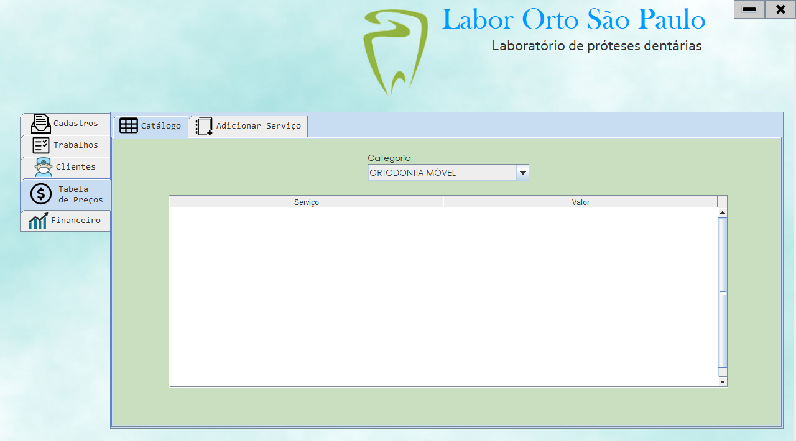
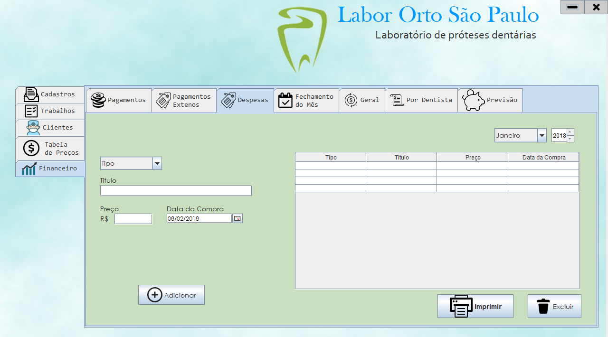

# JAVA_Nota_N-o_Fiscal

## Synopsis

System in **JAVA** developed for a client with the purpose of organizing the expenses and profits of his and printing notes with the prudutos sold and reporting on them;

## Demo Screens

## API Used

https://itextpdf.com/
